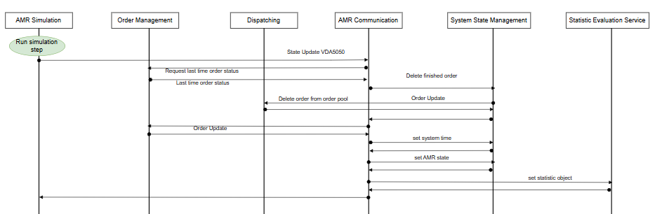

# AMR Communication
This microservice is responsible for the communication between the fleet management system and the amr
simulation or the real robots. The mqtt communication protocol is specified on the vda5050 standard.
Furthermore, this service can also request new order after some state updates form the amrs. 

## 1. Deployment:

### a.) Deployment microservice for the fleet management system using python
To deploy the amr communication service locally, run 
```
pip install -r requirements.txt
```
to install all dependencies. Then, run ``main.py``.

To test the endpoints open your browser at: http://localhost:3003/docs

### b.) Deployment microservice for the fleet management system using docker
1. Open a new wsl terminal
2. To deploy the amr communication service via docker, build the docker image using the Dockerfile by executing
```
docker build -t amrcommunication .
```
3. Then, run a container from created image with the IMAGE_ID by executing
```
docker run -p 3003:3003 -t IMAGE_ID 
```
To test the endpoints open your browser at: http://localhost:3003/docs

## 2. Project Structure:
- api: All content regarding the restful api is placed here.
- config: All content regarding config parameter of the microservice is placed here.
- data: All content regarding the data models is placed here.
- log_config: All content regarding the logging is placed here.
- logic: All content regarding calculation of logical processes is placed here.
- tests: ALl content regarding testing is placed here.

## 3. Configuration Parameter:
In the ./config/config_file.py file you can set some configuration parameter:
- PORT: 3003 (default)
- HOST: '0.0.0.0' (default)
- MQTT_BROKER_PORT: 1883 (default)
- MQTT_RECONNECT_RETRIES 3 (default)


- STORAGE_LOCATION_TRACKING: Specify if the storage location tracking services are activated or running.
- AMR_SIMULATION_ACTIVE: Boolean, if the simulation is connected and active or the direct communication to the robots. 
- USE_MQTT: Boolean, distinguished between a synchron fast api and a asynchron mqtt communication.


- Logging Level Parameter and paths
- A lot of other ports and network addresses of the other microservices, which communicate with the order management
service. 

## 4. API-Documentation
- OpenAPI Specification: [`docs/openapi.json`](docs/openapi.json)

## 5. Process State Update
When the amr communication service get a state update via VDA5050, Figure 1 shows the sequence diagram of the
called functions and microservices to process the state update:



[Figure 1: Sequence diagram state update VDA505]