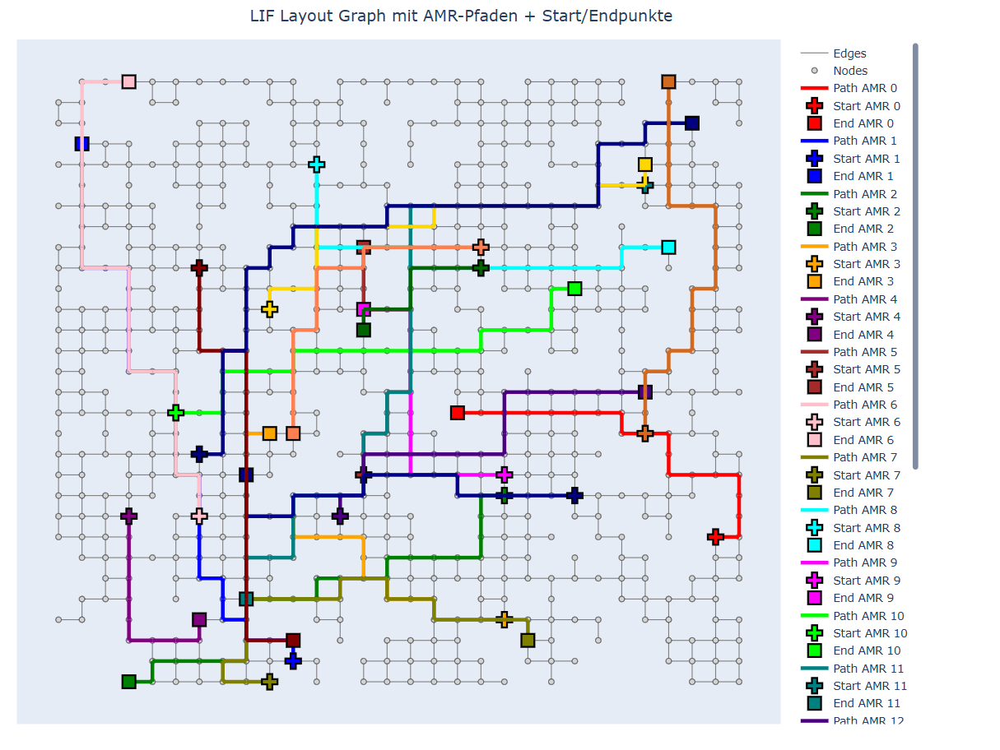
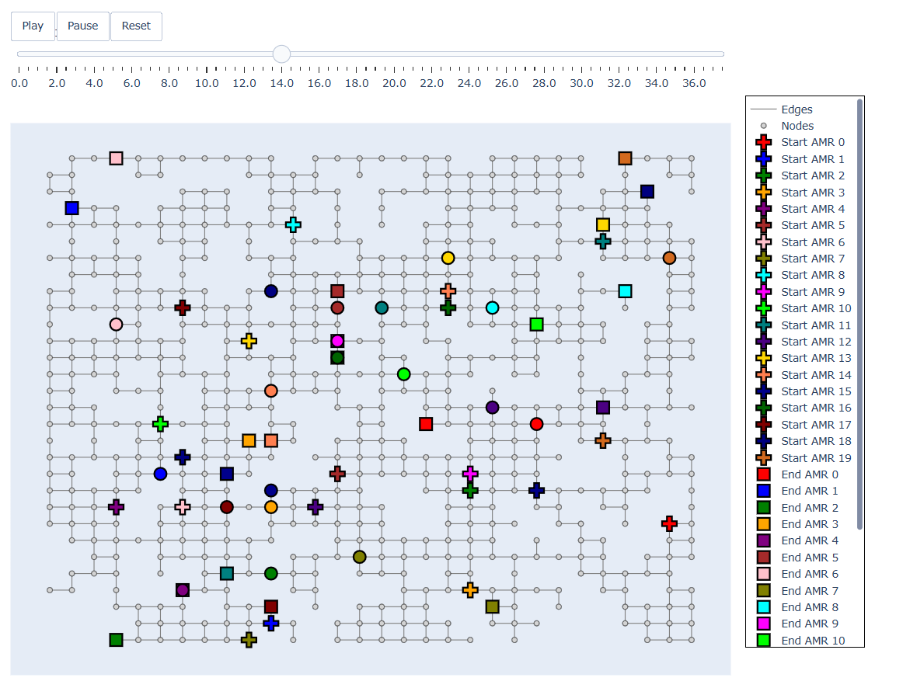
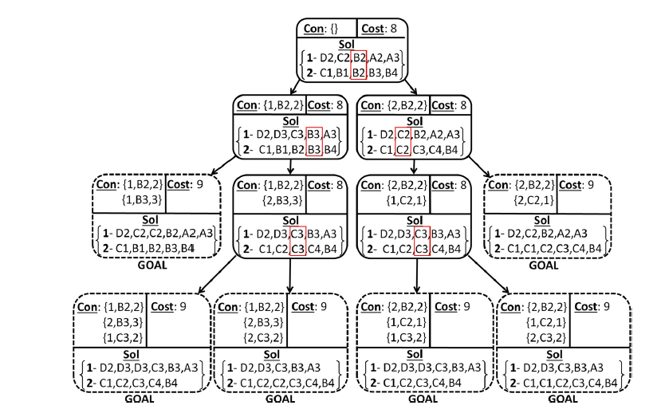

# Path Planing Service
Microservice responding to request regarding travel times and planning collision-free paths for a multi-agent system.

## 1. Deployment 
### a.) Deployment microservice for fleet management system using python:
To deploy the path planning service locally, run 
```
pip install -r requirements.txt
```
to install all dependencies. Then, run ``main.py``.

To test the endpoints open your browser at: http://localhost:3006/docs

### b.) Deployment microservice for fleet management system using docker:
1. Open a new wsl terminal
2. To deploy the traveltime service via docker, build the docker image using the Dockerfile by executing
```
docker build -t pathplanning .
```
3. Then, run a container from created image with the IMAGE_ID by executing
```
docker run -p 3006:3006 -t IMAGE_ID 
```
To test the endpoints open your browser at: http://localhost:3006/docs

### c.) Deployment microservice for solving MAPF instances api interface:
Start the microservice like in the fleet management system and load the graph with the lif-file in the service.
Then you can normally set, like in the evaluation the desired algorithms.
Finally, you can request this service for solving a MAPF instance with the post api solve-path-planning-request,
described later in section 7.

### d.) Deployment microservice for solving MAPF instances local:
After installing all dependencies, like in a.), select the desired MAPF instance in ./config/lif_generation_config.py (described later in 4) and the 
algorithm to solve the MAPF instance in ./config/config_file.py (described in 3).
Then run the python script in the folder: 
```
python3  ./tests/random_lif_generator/start_path_planning_instance.py
```

Figure 1 shows the computed paths of the MAPF problem and Figure 2 shows the solution animated over time for all agents:


[Figure 1]


[Figure 2]


## 2. Project structure:
- api: All content regarding the restful api is placed here.
- config: All content regarding config parameter of the microservice is placed here.
- data:
  - data_structures: The graph object and extended graph object with more information is placed here.
  - models/enums: All content regarding the data models is placed here.
- demo_methods: Scripts for the initialization of the demonstrator and datetime transformation is placed here.
- interfaces: All content regarding the path planning, heuristic, collision detection and low-level search interfaces
is placed here.
- log_config: All content regarding the logging configuration.
- mapf_algorithms: All content regarding path planning is placed here.
  - api_services: All content regarding service methods to process the incoming api calls.
  - collision_detection:
    - amr_object: All content of the configuration of the AMR for advanced collision detection is placed here.
    - bentley_ottmann: Sweep line methods to detect collisions geometrically integrated from: https://github.com/lycantropos/bentley_ottmann/blob/master.
    - collision_detection_classes: All classes of collision detection from the collision detection interface are
    implemented here.
    - detectors: All collision detection functions are placed here.
    - collision_detection_help_functions: Some additional help functions for collision detection.
    - solver: Solver for solve collision detected with bentley ottmann algorithm.
  - core: All content regarding the initialization of the path planning service
  - heuristics: Different heuristics for path planning, like euclidean or manhattan distance, or focal heuristics,
  e.g. count the number of collisions of multiple AMRs.
  - methods: All help methods to select the right classes and interfaces and initialization methods for the microservice.
  - path_planning:
    - multi_agent_path_planning: All content regarding multi-agent path planning algorithms is placed here.
      - high-level: All content regarding high-level search algorithms for the conflict tree is placed here. 
        - CBS: Conflict Based Search algorithm
        - CBS with disjoint splitting: Conflict Based Search algorithm with disjoint splitting, this means also agent specific positive constraints.
        - ECBS: Suboptimal Enhanced Conflict Based Search
        - ECBS with disjoint splitting: Suboptimal Enhanced Conflict Based Search with disjoint splitting.
      - low_level: All content regarding the low-level search algorithms for plan agent paths is placed here.
        - A Star: Classical A Star algorithm with space-time constraints.
        - A Star with agent specific constraints: A Star algorithm with space-time constraints dependent of the agent for the CBS disjoint splitting variant.
        - Focal Search: Focal search algorithm for ECBS. 
        - Focal Search with agent specific constraints: Focal search algorithm for ECBS with space-time constraints dependent of the agent for the CBS disjoint splitting variant. 
        - Interval A Star: A Star with other collision data type for geometrically collisions.
        - Interval Focal Search: Focal search with other collision data type for geometrically collisions.
    - prioritized_planning: Multi-agent prioritized path planning algorithm cooperative a star.
    - single_agent_path_planning: Single agent path planning algorithm dijkstra.
- tests: ALl content regarding testing is placed here.
  - random_lif_generator tests MAPF instances
  - test_data: Test data for logic tests of path planning.
  - other tests ...
- main: Start point for the microservice.

## 3. Configuration Parameter Travel Time Service:

In the ./config/config_file.py file you can set some configuration parameter:
- PORT: 3006 (default)
- HOST: '0.0.0.0' (default)


- MAX_TIME_ROUTING: Maximum time for answer a routing request in the fleet management system.
- MAX_TIME_CBS: Maximal time in seconds to find a conflict-free solution of multi-agent path planning problem with CBS/ECBS,
from the start points to the goal locations
- MAX_GENERATED_NODES_CBS: Maximal number of generated nodes in CBS/ECBS to find a conflict-free solution.
- MAX_A_STAR_TIME: Maximal time in seconds to find a solution of a single agent path planning problem with constraints with A Star.
- SCENARIO_LIF_FILE: '' (default), initialization of the microservice with no lif-file
, must be set later, in the other case selecting a lif-file is also possible.


- PATH_PLANNING_STRATEGY: Enum to select the path planning algorithms for plan a route of an order,
e.g. dijkstra, cooperative A Star, CBS, ...
- PATH_PLANNING_HEURISTIC: Enum to select the path planning heuristic, for path planning algorithms,
which use A Star, e.g. Manhattan Distance, Euclidean Distance, Dijkstra, ...
- COLLISION_DETECTION_STRATEGY: Enum to select collision detection method, such as classical discrete id,
classical interval id, prechecking intervals id, prechecking geometric full, prechecking geometric partial


- OPTIMALITY_BOUND: Optimality bound for ECBS.
- ECBS_HEURISTIC: Focal Heuristic for ECBS
- FOCAL_RANDOM_SEED, H4_MULT, EIG_ALPHA, EIG_BETA: Only important for some special focal heuristics

- DIRECTED_GRAPH: Boolean, if graph directed, if true, the edges can only traversed from the start node to the end node.


- COST_FUNCTION: Optimization goal for CBS and ECBS, e.g. service time or Makespan
- DURATION_EDGE: Duration to move from one node to another node, only important for discrete algorithms, like CBS not CCBS
- MAX_SPEED_EDGE: Maximum allowed speed on an edge for initialization the initial ttm, if LIF-file contains only nodes, no edges.
- AMR_RADIUS: Important for collision detection.

- CBS_COST_FUNCTION_IMPROVEMENT: False (defualt)
- PATH_POST_PROCESSING: False (default), to remove cycle in paths if possible without other collisions


- REAL_TIME_ROUTING_THRESHOLD: For statistic, how often threshold is exceeded (seconds).

- Logging Level Parameter and paths
- A lot of other ports and network addresses of the other microservices, which communicate with the travel time service. 


## 4. Configuration Parameter Test Single MAPF Instances:
In the .tests/random_lif_generator/lif_generation_config.py file you can set some configuration parameter creation a random lif file
to solve single MAPF instances:
- GRID_TYPE: Select "square" or "triangular" grid type for random graph generation
- GRID_WIDTH: Select size of the graph.
- GRID_HEIGHT: Select size of the graph.


- REMOVE_NODE_PROBABILITY: Probability to remove node in the grid to get a random graph
- RECONNECT_PROBABILITY: Probability to reconnect nodes after removing nodes.
- RECONNECT_DIAGONAL_PROBABILITY: Probability to reconnect nodes after removing nodes diagonal.
- NUMBER_OF_PATHS: Number of created start and goal nodes for test path planning algorithms.


- LIF_PATH: Path of the lif-file. (LIF-files from the instance generator also usable)
- PATH_PAIRS_FILE: Saved sampled start and end nodes for path computation.


- GENERATE_NEW_DATA: Boolean, if new data should be generated and saved.
- SHOW_LIF: Show found path planing solution animated in a window. 

## 5. Path planning Algorithms Overview and Components

### a.) Dijkstra:
Solves the shortest path problem for a single AMR optimal, but don't consider collisions with other AMR and has a high runtime. [1]

### b.) Cooperative A-Star:
Cooperative A-Star [2] contains to the class of prioritized path planning algorithms. The algorithm contains
time-location constraints from previous planned paths, which he must avoid. So the first path don't contain constraints.
One drawback ist, that some instances are not solvable with this approach and there are often better solutions,
this means the algorithm is not optimal in relation to all agents.

### c.) Conflict-Based-Search:
Conflict-Based-Search (CBS) [3] is an optimal multi-agent path-finding algorithm. CBS contains a high-level search on a
conflict-tree, see figure 1. In this conflict tree, each node represent a set of constraints for the movement of the agents. 
In the low-level search of the node with the lowest cost in the conflict tree, the goal ist to find a path for the
single agent problem, which satisfied the constraints.
Drawback are, that already planned paths must be included in the planning again, it is an offline approach from start
points to the goals and this approach has a very high runtime. Although it might perform quite good on low populated dense graphs.



Figure 3: An example conflict tree of CBS [3]

### d.) Conflict-Based-Search with Disjoint-Splitting: 
Conflict-Based Search with Disjoint Splitting [4] is an improvement of CBS with another conflict/constraints management
in the high-level search. For each conflict, the conflict node is splitting in a node with a negative constraint, e.g.
agent x is not allowed to be at node B at time point 2, and in a node with a positive constraint,
e.g. agent x must be at node B at time point 2. Through the disjointed splitting of the conflict tree, the tree will
be smaller and deliver results faster. Furthermore, through the fix positions because the positive constraints,
the low-level search must be only find paths between positive constraints.

### e.) Enhanced Conflict-Based-Search: 
Another enhancement of CBS is Enhanced CBS (ECBS) [5], a suboptimal variant, with a approximation factor w the high- and
low-level search works with a focal search which consists of two lists, the open and focal lists. In the focal list are all elements from the open list,
which are at most a factor w away from the current best costs in the open list.
The element considered from the focal list is selected by a focal heuristic.
This heuristic for example counts the number of collisions between the paths. With this procedure, we also get a
smaller conflict tree in the high-level search, but by additional computing the focal heuristic in the low-level search,
the low-level search needs more time for convergence.

### f.) Interval-CBS and Interval-ECBS
These are altered versions of ECBS and CBS that implement a sweep-line heuristic and a quadratic solver to compute extremely precise 
collisions in the high level. To achieve this the collision detection works with a vectorspace instead of the graph. 
So these two algorithms are functional with different edge lengths and driving durations on edges (more see section Collision Detection),
as well as non-orthogonal edges in a graph. The difference to CCBS (see below) is the low level which ist still descretized.

### Sources
- [1]: Johnson. "A Note on Dijksta's shortest path algorithm." JACM 20 (1973): 385-388
- [2]: Silver, David. "Cooperative pathfinding." Proceedings of the AAAI conference on artificial intelligence,
and interactive digital entertainment. Vol. 1. No. 1. (2005)
- [3] Sharon, Guni, et al. "Conflict-based search for optimal multi-agent pathfinding." Artificial intelligence 219 (2015): 40-66
- [4] Li, J., Harabor, D., Stuckey, P.J., Felner, A., Ma, H., &Koenig, S. (2019, July). Disjoint splitting for
multi-agent path finding with conflict-based search. In Proceedings of the international conference on automated
planning and scheduling (Vol. 29, pp. 279-283)
- [5] Barer, M., Sharon, G., Stern, R., & Felner, A. (2014) Suboptimal variants of the conflict-based-search algorithm
for the multi-agent pathfinding problem. In Proceedings of the international symposium on combinatorial Search (Vol. 5, No. 1, pp. 19-27)


## 6. Collision Detection:
Collision detection is split into two main algorithmic approaches:
### 6.1 Classical Collision Detection
The classical collision detection checks for pairwise AMR all timesteps and positions and reports collisions on nodes and edges of the graph.

### 6.2 Heuristic Prechecking Collision Detection (Bentley-Ottmann Collision Detection): 
The heuristic used for checking collisions is as follows. Considering the start and end of an AMRs action we can associate each amr with a vector.
Checking for all intersections of all AMRs at a specific point in time with a sweep line Algorithm in this case the Bentley-Ottmann algorithm we get all possible collisions at this specific time.
Doing this for all action changes of all AMRs will find all possible collisions on the whole scenario. Notice that if a collision exists it will be found. 
The implementation adds payloads to the implementation of lycatropos: https://github.com/lycantropos/bentley_ottmann.
To verify if a possible collision was a correct collision two solvers are used for different algorithms:
- Quadratic solver, this solver is used in cases with some restrictions regarding the movement of the AMR 
- Log-search with Newtons method over action interval, this solver can be used if most of the restrictions are lifted.

Some Data structures are more or less feasible for specific solver data.
- Dictionary: 
If the solver works on Ids this is perfectly fine.

- Interval Tree over the Graphs Nodes and edges: 
For using Intervals a data structure using precise intervals is needed. Whenever the timesteps are not implicitly given by the system and speeds, directions, or radii od AMR are not necessary, this data structure is used.
It gives every graph object an Interval Tree containing all Intervals on which the object is occupied.

- Constraints 3D:
If the solver needs spacial information the solver needs to use a vector representation. Since this mostly ignores the graphs structure this allows the usage of nonzero radii and arbitrary edge lengths and directions.
A constraint is now considered a 3-dimensional object (x-dim, y-dim, time-dim) and a check for a violation checks for the intersection of a queue 
(an object defined by: drive from (a,b) to (x,y) on the time interval [t1, t2] with the speeds (...) and radius r) with each constraint.

### 6.3 Implemented Collision Detection Algorithms

#### 6.3.1 Classical Collision Detection:
The classical collision detection checks for pairwise AMR all timesteps and positions and reports collisions on nodes and edges of the graph.
This uses unique IDs of graph objects and discrete (and finite) timesteps. These methods can only be used in the standard CBS and ECBS variants.
It has the property:
- Feasible for discrete timesteps
Additionally it needs:
- Constant vehicle speeds
- Constant Edge lengths 
- Vehicles with no radius

#### 6.3.2 Classical Interval Tree Collision Detection
Employs interval trees on the graph to make the collision detection on intervals possible. It is a variant of classical Collision detection, which extends the use-case of classical detection onto 
detection handling via interval trees onto intervals. It can be used in the Interval versions of CBS and ECBS (ICBS, IECBS).
It has/needs the properties:
- Possible for continuous times
- Edge length is considered
Additionally it needs:
- Constant vehicle speeds
- Vehicles with no radius


#### 6.3.3 Graph Ids Collision Detection
This algorithm uses the heuristic prechecking method on the graph object. Otherwise, it is similar to the classical interval tree collision detection and has ist use in the same algorithms.
It can be used in the Interval versions of CBS and ECBS (ICBS, IECBS).
It has/needs the properties:
- Possible for continuous times 
- It finds the first collision in time first
- Edge length is considered
Additionally it needs:
- Constant vehicle speeds
- Vehicles with no radius

#### 6.3.4 Geometric Graph Ids Collision Detection
This algorithm exchanges the interval tree constraint structure of the graph id collision detection by the constraints3D data structure, enabling a geometrical interpretation of collisions and paths. 
It can be used in the Interval versions of CBS and ECBS (ICBS, IECBS).
It has/needs the properties:
- Possible for continuous times 
- It finds the first collision in time first
- Edge length and edge directions are considered
- Vehicles can be circular (have a radius)
Additionally it needs:
- Constant vehicle speeds


#### 6.3.5 Geometric Zones Collision Detection
To use this solver the Bentley-Ottmann heuristic is split into two levels the action change level and the speed change level.
This is done since a speed change can be considered an action change but this would significantly increase number of Bentley-Ottmann tours necessary. 
Checking speed changes only for possible collisions increases the execution time greatly. 
After the second level an interval is given and Newtons method is used to solve a distance formula corresponding to the current scenario. 
It has the following properties:
- Possible for continuous times 
- It finds the first collision in time first
- Edge length and edge directions are considered
- Varying vehicle speeds
- Vehicles can be circular (have a radius)

## 7. Routing api interface for MAPD in fleet management system:

The currently used api call for routing requests is the post "/routing-for-all-amrs" api call. 
There, the RoutingRequestObject is required, which contains all information for the path planning algorithms:

**RoutingRequestObject:**
- mapId
- routingAMR: List[RoutingAMRInfo]
- newOrderIds: List[str]
- deliveryOrderIds: List[str] | None = None
- planorderIds: List[str] | None = None
- constraints: Set[Tuple[Union[str, Tuple[str, str]], Union[int, Tuple[int, float]]]] | None = None

**RoutingAMRInfo:**
- amrId: str
- lastNodeId: str
- order: Order
- token: Token | None


So, the request object contains the map id, a list of order ids of new planned orders and for all AMR the corresponding id,
the last node position, the order and the token with the previous planned path. 

Next, the routing depends on the selected path planning strategy. For the dijkstra algorithm a single path planning
problem is always solved from the current location to the pickup and then to the delivery location of the order.   
With cooperative a-star, the paths of the new orders are planned with time-location constraints from the previous
planned orders or the resulting tokens.  
CBS plans all paths of the AMR new and updates the existing orders. Therefore, it exists a relevant node sequence object, e.g.:

{'AMR1': [Last_Node_1, Pickup_Node_1, Delivery_Node_1], 'AMR2': [Last_Node_2, Delivery_Node_2], 'AMR3': [Last_Node_3, Pickup_Node_3, Delivery_Node_3]}

At first the CBS is executed to the first both nodes of each AMR. The resulting paths for all AMR are then pruned up to
the timestamp, when the first AMR reach the intermediate destination.
Then the relevant node sequence is updated with these paths, for example AMR3 reach at first the pickup location:

{'AMR1': [Next_Node_1, Pickup_Node_1, Delivery_Node_1], 'AMR2': [Next_Node_2, Delivery_Node_2], 'AMR3': [Pickup_Node_3, Delivery_Node_3]}

This procedure is always repeated until the length of the node list in the relevant node sequence is
equal to one for each AMR, this means each AMR has reached its goal.
With this procedure, we obtain paths for each AMR from the last position to the pickup and then to the delivery location. 
If several AMR have to reach the same destination node, e.g. at the same pickup locations, the closest free node
is searched for the next AMR and in the next iteration this AMR can Route to the pickup location, while the other AMR
is already routing to the delivery location. 

## 8. Routing api interface for MAPF instances:
To solve a single MAPF instance with given start- and goal points for each agent you can use this api call:
```
@app.post("/solve-path-planning-request")
```

**PathPlanningRequest:**
- start_node_ids: List[str]
- end_node_ids: List[str]
- show_solution: bool = False
- path_planning_strategy: str | None = None
- boundary: float | None = None
- distance_heuristic: str | None = None
- focal_heuristic: str | None = None
- cost_function: str | None = None
- layouts: List[Layout] | None = None

In the associated PathPlanningRequest object it is required to give the start node ids and end node ids 
for the MAPF instance. All other information are not required, e.g. if this service is already initialized with a
lif-file or a path planning algorithm is already set, so the previously setting will be used.


## 9. API-Documentation
- OpenAPI Specification: [`docs/openapi.json`](docs/openapi.json)