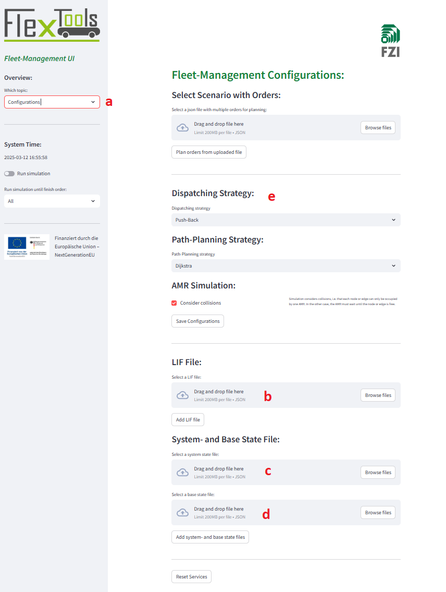
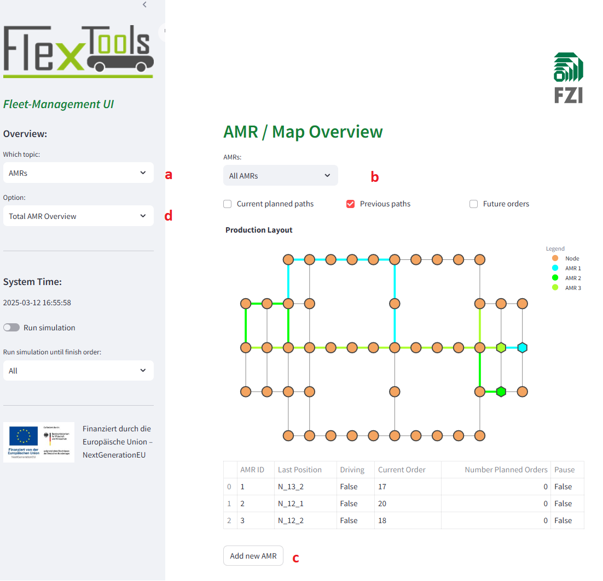
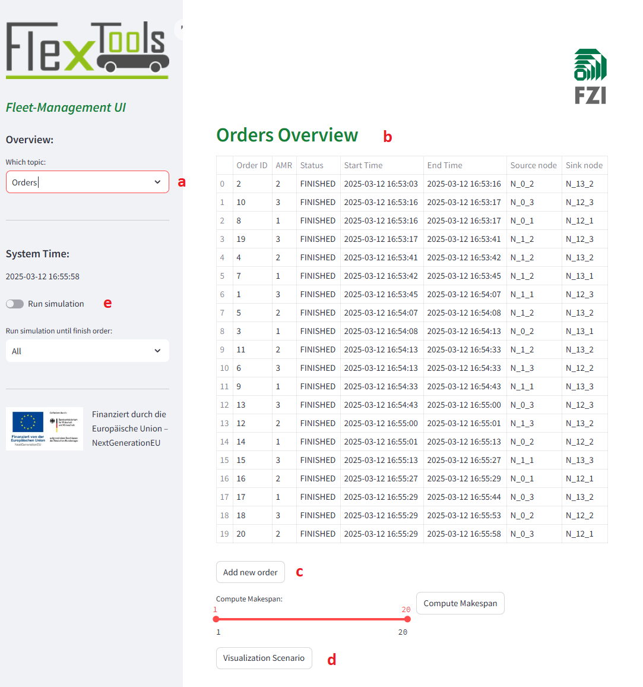

# User Interface

Microservice for the users of the fleet management system, to get an overview over the current system state and
add orders to the system. Furthermore, you can start scenarios for evaluation the system.

## 1. Deployment:

### a.) Deployment microservice for the fleet management system using python
Ton deploy the user interface service locally, run:
```
pip install -r requirements.txt
```
to install all dependencies. then, run ``streamlit run app.py``

To see the dashboard open your browser at: http://localhost:3010

### b.) Deployment microservice for the fleet management system using docker
1. Open a new wsl terminal
2. To deploy the user interface via docker, build the docker image using the Dockerfile by executing
```
docker build -t userinterface 
```
3. Then, run a container from created image with the IMAGE_ID by executing
```
docker run -p 3010:3010 -t IMAGE_ID 
```
To test the endpoints open your browser at: http://localhost:3010/docs

## 2. Project Structure:
- .stramlit: Includes a config file for the streamlit dashboard web application.
- api: include the api calls for the data import
- config: All content regarding config parameter of the microservice is placed here.
- data: All content regarding the data models is placed here.
- figures: Implementation for the visualization of the data.
- images: Images for the user interface are placed here.
- logic: Implementation of methods, for example to get data.
- tests: Implementation of tests for testing the functionality of the system.
- app.py: Main streamlit dashboard component. 

## 3. Configuration Parameter:
In the ./config/config_file.py file you can set some configuration parameter:
- PORT: 3010 (default)
- HOST: '0.0.0.0' (default)


- MAP_ID_DEFAULT: default 'map1', is set automatically with loading the Layout.
- STORAGE_LOCATION_TRACKING: Specify, if storage location tracking service are connected and running.
- SIMULATION_ACTIVE: Boolean, if the simulation is connected and active or the direct communication to the robots,
for order transfer.
- MAX_SPEED_EDGE: Default parameter for initialization Layouts if no information available.
- MAX_EVALUATION_TIME: In seconds, if an evaluation scenario is started via the user interface.


- A lot of other ports and network addresses of the other microservices, which communicate with the order management
service. 


## 4. User Interface Basics: 
1. For start a desired scenario, you can select on the configuration page (a) an LIF-file (b), set the system state and 
   base state data (c) and select a scenario with orders (d). At (e) you can select the algorithms for path planning
   and dispatching the orders to the AMR:

   

2. At the AMRs page (a), you can see the production layout with current information about the position of the amr and
   current executed order (b). Further you can add new AMR to the system (c) and select a single AMR to get
   more extra information about the selected AMR (d):

   

3. This page (a) provides you an order overview about current orders in the system (b). Among other thing, you can create
   a new order there (c) and visualize the simulated scenario (d). Furthermore, you can also start the simulation 
   that the AMR is processing the orders on all pages in the sidebar (e):

   

