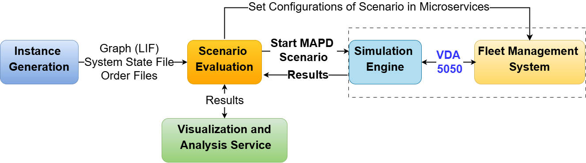

# Lay2Graph-MAPD: A Modular Framework with Layout-Aware Graph Generation for Multi-Agent Pickup and Delivery Problems

[](https://doi.org/10.5281/zenodo.21410202)
[](../LICENSE)
[](https://github.com/fzi-forschungszentrum-informatik/flextools-algorithmen-repository/releases)


## 🟢 What is it?
This algorithm repository provides a modular framework for planning and controlling Autonomous Mobile Robots (AMRs) in
intralogistic processes.
The system is designed to facilitate the deployment of AMRs in brownfield environments by enabling flexible integration,
adaptability to existing infrastructure and data-driven optimization of robot operations.

## 🔗 Repository and Citation
The archived release associated with the paper is permanently available on Zenodo:

The latest development version is available on GitHub:
https://github.com/fzi-forschungszentrum-informatik/flextools-algorithmen-repository

If you use Lay2Graph-MAPD in your research, please cite the corresponding publication and/or the Zenodo release.

## 📁 Components
The repository consists of two main components:

### 1. Fleet Management System (`./FleetManagementServices`)
Plans and controls the AMRs in intralogistic processes, including collision-free path planning, task assignment,
an order management database, a user interface for fleet management and monitoring and more. 
The system is based on industrial standards such as VDA5050 [1] and the Layout Interchange Format (LIF) [2].

### 2. Scenario Evaluation Services (`./ScenarioEvaluationServices`)
Provides tools for evaluating the fleet management system, including an event-driven simulation, a benchmark generation
service to generate different routing graph structures for various layouts,
a visualization service for analyzing the results and a service for automated processing the experimental evaluations.

Figure 1 illustrates the overall system and the interaction between all components:



[Figure 1: Components Lay2Graph-MAPD]

[1]: Vda5050 - Version 2.1.0 (2024), https://github.com/VDA5050/VDA5050/tree/main

[2]: LIF - layout Interchange Format (2024), https://vdma.eu/documents/34570/3317035/FuI_Guideline_LIF_GB.pdf


## 🛠️ Deployment (End-to-End)
This repository supports both containerized and local execution. 

To run the evaluation, or the complete pipeline, as described in the paper "Lay2Graph-MAPD: A Modular Framework with
Layout-Aware Graph Generation for Multi-Agent Pickup and Delivery Problems", the following steps can be performed:

### Generate MAPD Instances
To generate MAPD instances for the evaluation, you can deploy the service `./ScenarioEvaluationServices/instance_generation`.
Here, layout configurations can be selected, adjusted or extended with new layouts.
Then you can execute the following steps:
```
cd ../ScenarioEvaluationServices/instance_generation
pip install -r requirements.txt
python main.py
```
After generating the desired instances, you can save the scenario evaluation service
'./ScenarioEvaluationServices/scenario_evaluation/evaluation_mapd/{Layout_Name}'. 

### Fleet Management System Docker Deployment
1. Go to the `./DockerComposeFiles/` directory.
2. In the `./.env` file, you can configure the INPUT_DATA_PATH, where the generated MAPD instances are located and
the OUTPUT_DATA_PATH, where the results should be saved.
3. Start fleet management system using docker compose:
```
docker compose up -d
```
4. For other docker compose files or configurations, e.g. without simulation in the case of real robots, you can start docker as follows:
```
docker compose --env-file ./evaluation.env -f docker-compose-evaluation.yml up -d
```

### Fleet Management System Local Deployment
1. Go to the desired services directories
2. Install all dependencies of the regarding service:
```
pip install -r requirements.txt
```
3. Set the configuration parameters in `./config/config_file.py`
4. Start the services:
```
python3 main.py
```

### Starting the Evaluation with the Evaluation Service
1. Go to the scenario evaluation service `./ScenarioEvaluationServices/scenario_evaluation`
2. Select the desired experiments in `start_multiple_evaluations.py`
3. Install all dependencies:
```
pip install -r requirements.txt
```
4. Start scenarios local:
```
python3 start_multiple_evaluations.py
```
5. Start scenarios on a server, e.g.:
```
nohup python3 -u start_multiple_evaluations.py > output.log 2>&1 &
tail -f output.log
```

### Control the Fleet Management System with the User Interface
You can also start evaluation instances or control the fleet management system with the user interface.
1. Go to the user interface `./FleetManagementServices/user_interface`
2. Install all dependencies: 
```
pip install -r requirements.txt
```
3. Start the user interface with:
```
streamlit run app.py
```
4. Further details regarding controlling the user interface can be found in the README of the service: 
`./FleetManagementServices/user_interface/README.md`

### Visualize and Analyze the Results
1. Go to the visualization and analysis service `./ScenarioEvaluationServices/visualizations_analysis`
2. Set the paths and connections for the saved results in `./config/config_file.py`
3. Install all dependencies: 
```
pip install -r requirements.txt
```
4. Go to `main.py` and select the visualizations and analysis you want to have.
5. Start:
```
python3 main.py
```

## 📖 Service Documentation (Where to find further details):
- Docker compose files: `./DockerComposeFiles/README.md`
- Service-specific parameters and scripts: `./Folder/service_name/README.md`

## 📚 Research Content:
This repository is associated with the paper "Lay2Graph-MAPD: A Modular Framework with Layout-Aware Graph Generation
for Multi-Agent Pickup and Delivery Problems" and is currently under review. The full citation will be added once the
paper has been published.

## 📄 License:
This repository is licensed under the MIT License. See [LICENSE](LICENSE).

Third-party license attributions and component-specific license files are documented in the corresponding 
THIRD_PARTY_NOTICES.md files of each service, where required, e.g. for the path planning service
[./FleetManagementServices/path_planning_service/THIRD_PARTY_NOTICES.md](./FleetManagementServices/path_planning_service/THIRD_PARTY_NOTICES.md).

## 👥 Authors:

### Fleet Management System: 
Justus Knierim <knierim@fzi.de>, Jonas Ringel

### Scenario Evaluation Services: 
Justus Knierim <knierim@fzi.de>

## Acknowledgements:


The research project "FlexTools - The Modular Toolbox for Flexible Robotics for Small and Medium-Sized
Automotive Suppliers" is funded by the Federal Ministry for Economic Affairs and Energy of the Federal Republic
of Germany and by the European Union under the NextGenerationEU programme, grant number 13IK032. 
