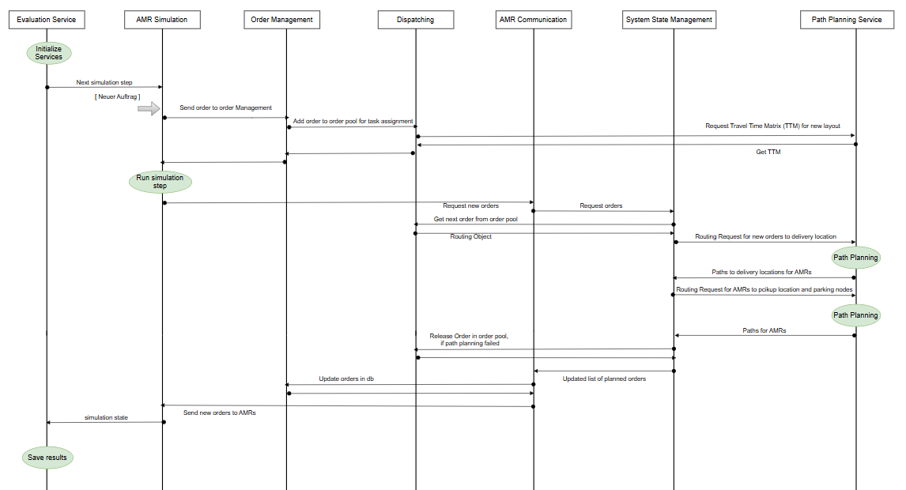

# AMR Simulation
Microservice responding to simulate the movement and processing of orders from AMR.

## 1. Deployment:

### a.) Deployment microservice for the fleet management system using python
To deploy the amr simulation service locally, run
```
pip install -r requirements.txt
```
to install all dependencies. then, run ``main.py``

To test the endpoints open your browser at: http://localhost:3011/docs

### b.) Deployment microservice for the fleet management system using docker
1. Open a new wsl terminal
2. To deploy the amr simulation service via docker, build the docker image using the Dockerfile by executing
```
docker build -t amrsimulation . 
```
3. Then, run a container from created image with the IMAGE_ID by executing
```
docker run -p 3011:3011 -t IMAGE_ID 
```
To test the endpoints open your browser at: http://localhost:3011/docs

## 2. Project Structure:
- agents: All content regarding the agents in the simulation is placed here.
- api: All content regarding the restful api and the mqtt is placed here.
- config: All content regarding config parameter of the microservice is placed here.
- data: All content regarding the data models is placed here.
- log_config: All content regarding the logging is placed here.
- logic: All content regarding the logical simulation processes and computations is placed here.
- statistic_data: All collected statistic data is placed here.


## 3. Configuration Parameter:

In the ./config/config_file.py file you can set some configuration parameter:
- PORT: 3011 (default)
- HOST: '0.0.0.0' (default)
- MQTT_BROKER_PORT: 1883 (default)
- MQTT_RECONNECT_RETRIES 3 (default)


- CHECK_COLLISIONS: Specify whether collision in the simulation should be considered and avoided.
- BATTERY_MAX_REACH_BY_INITIALIZATION: Default value for the maximum range of a fully charged AMR,
if charge management is activated
- WAITING_TIME_ON_NODE: Waiting time on a node, if an amr should wait one or more time steps on a node. 
 This value should be adapted to the drive time over an edge from one node to another node. 
- TASK_ASSIGNMENT_STRATEGY: Determine task assignment strategy, if amrs should self request new orders.


- VISUALIZE_SCENARIO: Boolean to visualize evaluated scenario.
- DEMO_BACKGROUND: Boolean, if graph should be visualized on demo image as background. 
- DEMO_IMAGE: Path to background demo image.
- DEMO_LENGTH: Length of demo image for visualization.
- DEMO_WIDTH: Width of demo image for visualization.


- AMR_STATISTIC_DATA_FILE: File, to save workload AMR data of evaluated scenario. 
- GRAPH_STATISTIC_DATA_FILE: File, to save data of graph utilities of evaluated scenario.


- Logging Level Parameter and paths
- A lot of other ports and network addresses of the other microservices, which communicate with the order management
service. 

# 4. AMR Simulation Procedure

This simulation is a discrete event simulation of the logistic process of amr in production systems.
This simulation runs in discrete time steps. After each timestep a simulation step is executed.
In each simulation step, first of all, all orders from the scenario with a publish time less than the current system
time will be published to the fleet management system. Then all amr do one simulation step.
At first, in this simulation step, the amr execute all actions of the current node. It is important, if this node the
first node of an order and contains actions. After this, the amr move tho the next node, if it does not cause a collision.
Of course, the amr can also wait one time unit if this is specified in the path of the current order.
After reaching the next node, the agent do also execute all actions on the reached node.
The all AMR send a state update to the amr communication service, specified according the vda5050 standard.
A status update is also sent, if the amr finish an action or get a new order or an update of a currently executed order.
The orders are also specified according the vda5050 standard. 
After all state updates from the fleet management system have been completed, new orders are requested. 
The complete procedure of a simulations step is shown in Figure 1 as sequence diagram of the different microservices.
The amr communication service knows about request for new orders, because it gets the header id of the last state
update from a simulation step via the put "/last-header-id-simulation-step" interface.
The orders can be submitted to the simulation via the post "/new-order" interface and an simulation step is
executed via the post "/step" interface.



[Figure 1: Sequence diagram simulation step]

## 5. API-Documentation
- OpenAPI Specification: [`docs/openapi.json`](docs/openapi.json)
