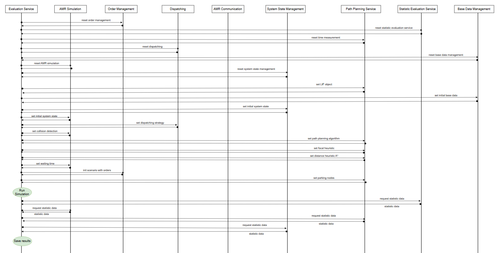

# Scenario Evaluation Service FlexTools Fleet Management System

Python project to evaluate scenarios of the fleet management system.

## 1. Deployment:
### a.) Deployment using python local
To evaluate the scenarios, run:
```
pip install -r requirements.txt
```
Next, in the start_multiple_evaluations_graphs.py file you can select the desired scenarios, algorithms, number of amrs,
orders and much more. After this you can start the evaluation:
```
python3 start_multiple_evaluations_graphs.py 
```
Important is, that the fleet management system is running during the evaluation.
You can view the evaluation results of each scenario in the corresponding folder of the scenario in the output folder as
*.csv file. Furthermore, if you run local the evaluation, you can see other data in the simulation microservice in the
./statistic_data folder, e.g. the edge and node utilisation or the status of all AMRs during the simulation time.

## b.) Deployment on server:
After starting the fleet management system with docker compose, described in the fleet management service, you can go to the folder ./scenarioevaluation.
There you can download the current version of the start_multiple_evaluations_graph.py file and the
scenarios in the ./input_data folder.
```
git pull origin development
```
After update the evaluation, you can go in the virtual environment with the installed packages:
```
source ./ev_venv/bin/activate
```
In the first time you have to install all python packages like in the local deployment.
Next, you can start the evaluation script:
```
nohup python3 -u start_multiple_evaluations.py > output.log 2>&1 &
```
You can show the current status of the evaluation with:
```
tail -f output.log
```
After finishing the evaluation all stored data are again in the corresponding ./scenario_name/output/ folder.
Furthermore, there are two more folders ./amr_data and ./graph_data with the statistic data of the simulation microservice.
These data are automatically placed to these folders through volumes in docker compose.

If you like see the result with figures, you can use the figures_evaluation service to generate figures or
get an overview of the data from the simulated scenarios.


## 2. Project Structure:

* api: include the api calls for set the evaluation properties of the corresponding microservice.
* config: All content regarding config parameter for the scenario evaluation are placed here.
* data: All content regarding the data models is placed here.
* evaluation_mapd: All content and scenarios regarding the evaluation scenarios of multi-agent pickup- and delivery problems for the
different layouts is saved here.
* evaluation_mapf: All content regarding the evaluation of single multi-agent path planning instances (MAPF) 
is placed here.
* logic: Implementation of methods, for example to get data.
* microservice initialization: All methods to initialize the microservices of the fleet management system are placed here.
* simulation: All methods to run the simulation steps in the simulation microservice is placed here.
* input_data: All scenarios are saved here.

## 3. Create new evaluation scenario:
1. To create a new evaluation scenario, you can use the instance generator microservice.
2. Add a folder with the name of the scenario in the ./evaluation_mapd folder.
3. Add to this folder further folders: base_data_files, lif_files, order_files, system_state_files, output
4. Add an evaluation_config.py script to the scenario folder.
5. Now you can add the order files, system state files and lif_files from the instance generator to the corresponding folders.
6. Last, you can adjust the config_file with the right file names, the default algorithms and
   add the parking points for each graph in this file.

## 4. Microservice communication protocol during the evaluation
Figure 1 illustrates the communication between the microservice for the evaluation of a MAPD scenario, in
, the order in which the services are reset, and the required functions are called.

[Figure1: Evaluation Sequence diagram microservices fleet management system]