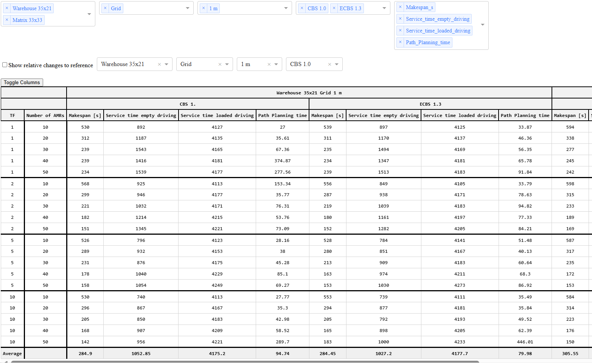
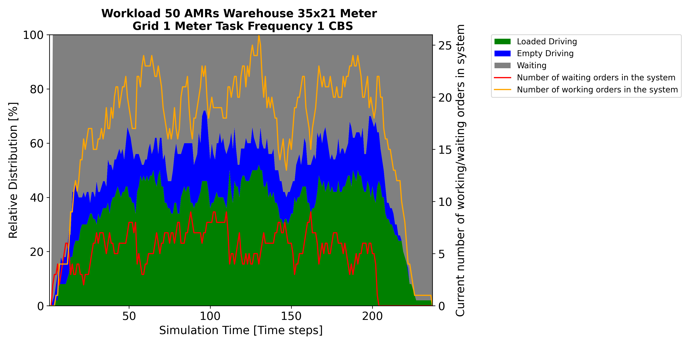
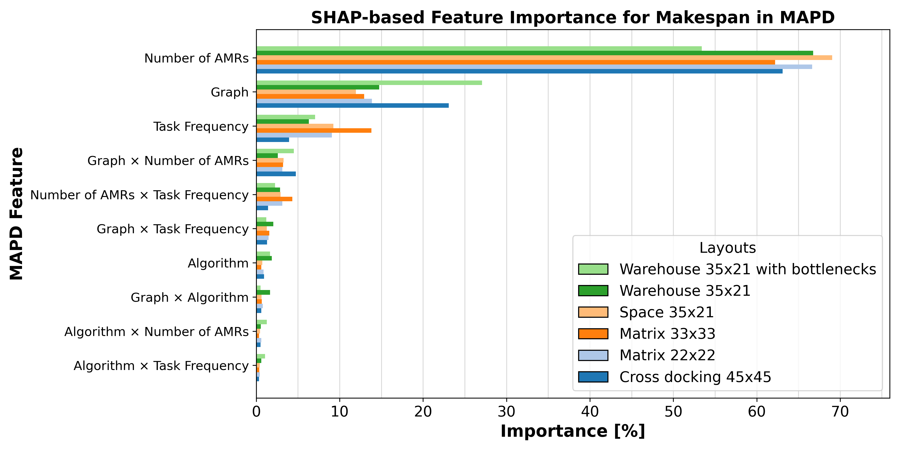
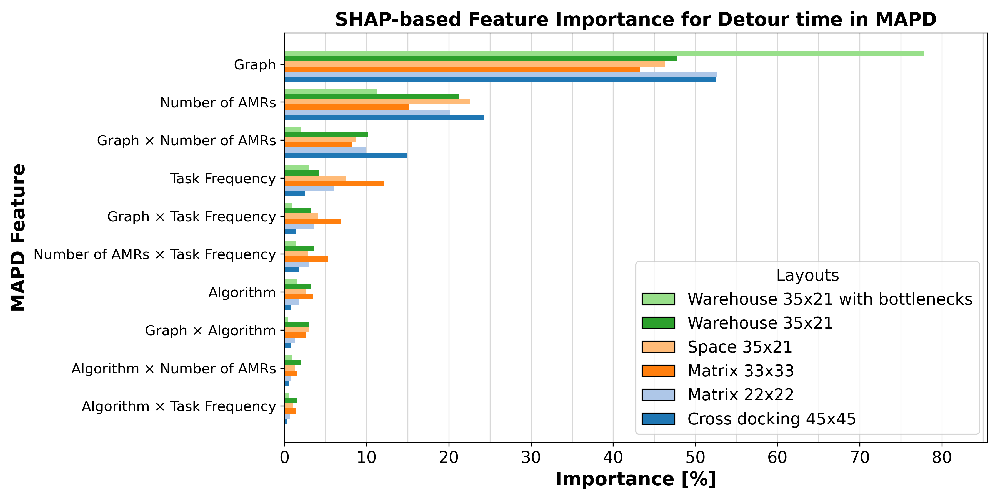
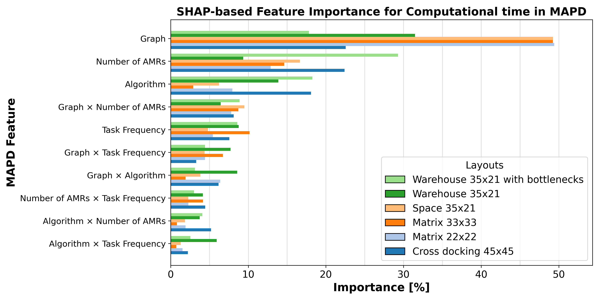
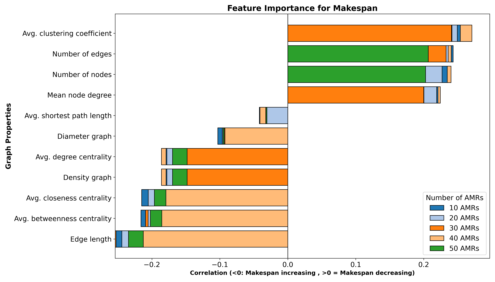
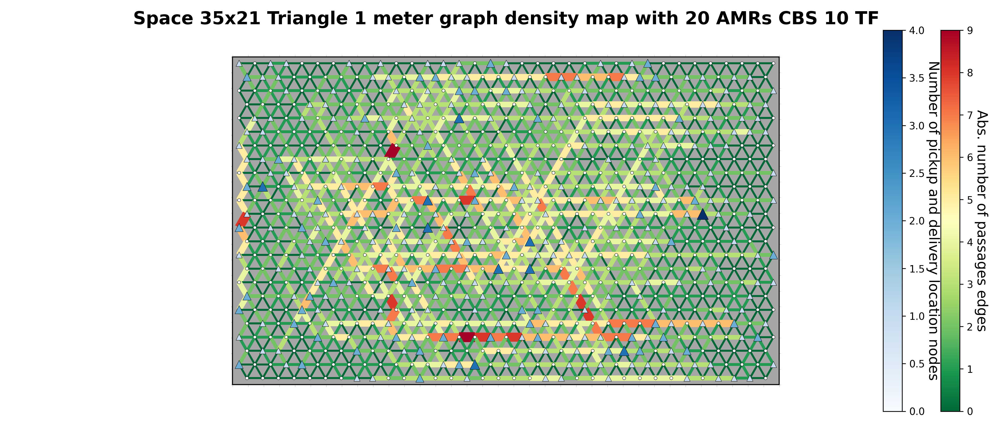
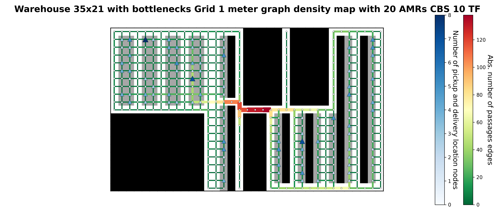

# Visualization and Analysis Service
The visualization and analysis service contains various visualization tools to display the current results of Multi-Agent
Pickup- and Deliver Scenarios during the evaluation in a dashboard and can create some statistical data analyses and
various diagrams from he results, such as correlation heatmaps, amr workload figures,
feature correlations, graph density plots and much more.

## 2. Deployment

To deploy the visualization management service locally, run
```
pip install -r requirements.txt
```
to install all dependencies. then, run ``main.py``


In ``main.py`` you can set create_figures=False in the visualization pipeline method, then dashboard of the
evaluation results is displayed. In the other case, 
the images are created from the selected data in the visualization pipeline method if
the image with the exact same filename does not already exist. 
Furthermore, you must select the database of the evaluation data,
the evaluation_mapd folder of the evaluation scenario folder in the connect and the get_amr_data_from_server method.
Required information to connect the database are e.g. host, port, username, password and path.


To compute graph properties correlation figures, you must put the graph property file from the instance generation
service for the considered routing graph in the ``./layout_data/graph_properties`` folder.


To compute graph utility density figures, you must put the image and the routing graph in the LIF-format in the
``./layout_graph_figures/images`` and ``./order_evaluation/lif_files`` folder.


To compute the additional detour of scenarios, you must put the routing graph in the LIF-format and the order files in
the ``./order_evaluation/lif_files`` and ``./order_evaluation/order_files`` folders.

## 3. Project Structure
- amr_data: Contains methods to plot the amr workload over the time.
- config: Contains configuration parameters for experimental result paths.
- detour_cache: Cache to speed up detour computation.
- evaluation_tables: Dashboard to visualize the evaluation results live.
- graph_figures: Contains methods to plot the makespan or additional detour progress depending on the number of AMRs.
- heatmap_figures: Contains method to plot correlation heatmaps of layout, routing graphs and used algorithms.
- layout_data: Contains methods to plot the results in correlation with the routing graph properties and SHAP-values. 
- layout_graph_figures: Contains methods to plot graph utilities density figures.
- order_evaluation: Contains help methods to compute the additional detour on the graphs. 
- scatter_plot_graph_properties: Contains methods to plot scatter plots with graph properties.

## 4. Visualization Overview
This section show some exemplary visualizations of the evaluated MAPD scenarios.

### a.) MAPD Evaluation Results Dashboard:

### b.) Workload AMRS: 

### c.) SHAP-Analysis Key Feature MAPD Performance:



### d.) Routing Graph Correlation Properties:

### f.) Density Map of Routing Graphs:

